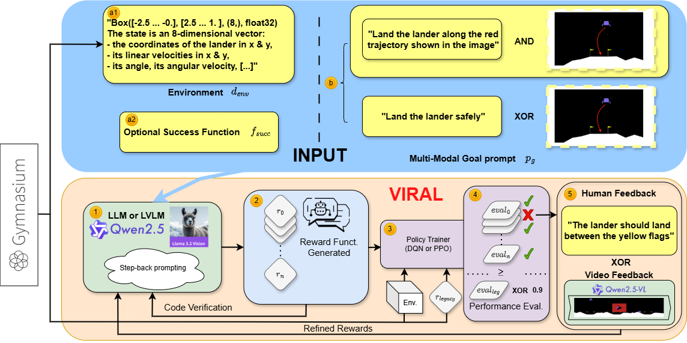

# VIRAL: Vision-grounded Integration for Reward design And Learning

Welcome to **VIRAL** — a framework for automatic reward function design in Gymnasium environments, leveraging the power of vision-language models to advance reinforcement learning.

---

## 🚀 Overview

**VIRAL** (Vision-grounded Integration for Reward design And Learning) provides a new approach to reward engineering, inspired by [DREFUN-V](assets/initial_idea.pdf). This project investigates how VideoLLMs (Video Large Language Models) can be used to better align reward functions with task objectives in RL settings.

For more details, see our [paper (PDF)](assets/VIRAL.pdf) or [ArXiv preprint](https://arxiv.org/abs/2505.22092).

---

## 📁 Repository Contents

- **Source code**: Core implementation of the VIRAL framework  
- **Project website and documentation**: [Documentation & Website](https://github.com/VIRAL-UCBL1/VIRAL-UCBL1.github.io)  
- **Experimental results**: [Results repository](https://github.com/VIRAL-UCBL1/results)  
- **Paper**: [Read the full paper (PDF)](assets/VIRAL.pdf) or on [ArXiv](https://arxiv.org/abs/2505.22092)  

---

## 📖 Get Started

For installation instructions, usage examples, and detailed documentation, please visit our [project website](https://viral-ucbl1.github.io/).

---

## 📚 Learn More

- **Course inspiration:**  
  [Theory and Practical Applications of Large Language Models – by Bruno YUN](https://bruno-yun.notion.site/Theory-and-Practical-Applications-of-Large-Language-Models-570124290ae1402ab94b567bfb9b7a08)

---

## 🙏 Acknowledgements

This project was developed as part of the course on Large Language Models at UCBL1, under the guidance of Bruno YUN.

---

**Questions or suggestions?**  
Feel free to open an issue or reach out via the [project website](https://viral-ucbl1.github.io/).
