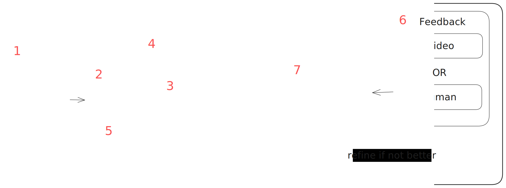

# Welcome to VIRAL

## VIRAL

Vision-grounded Integration for Reward design And Learning is inspired by [DREFUN-V](assets/initial_idea.pdf). This project aims to create a framework for reward function generation in Gymnasium environments, utilizing and VideoLLM in order to  enchance aligment too. Below, you can see how the framework is structured.

## Diagram

For more details about the diagram, you can refer to our paper: [paper](assets/VIRAL.pdf)

## Further Understanding

You can visit our website, which provides installation instructions as well as project documentation:  
- [Documentation](https://viral-ucbl1.github.io/)

We also provide a link to the course by Mr. YUN that we attended:  
- [Course](https://bruno-yun.notion.site/Theory-and-Practical-Applications-of-Large-Language-Models-570124290ae1402ab94b567bfb9b7a08)
